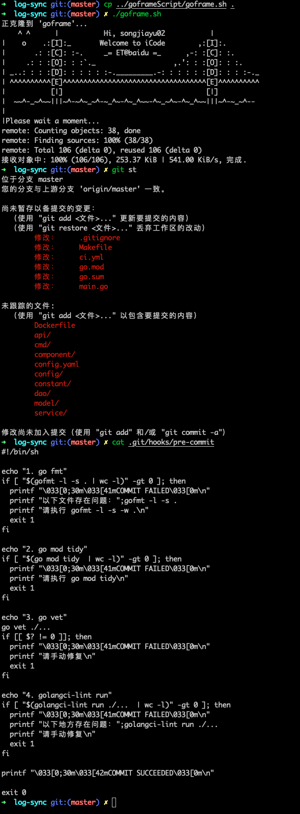
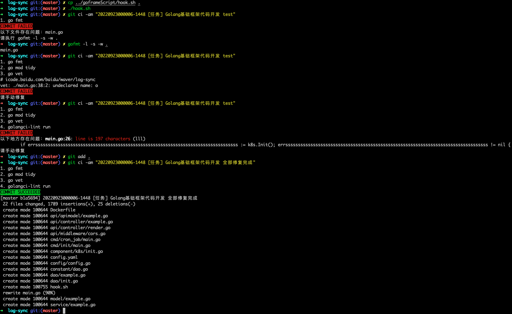

# goframe.sh
goframe.sh包含两个功能
1. 按照代码库[goframe](https://console.cloud.baidu-int.com/devops/icode/repos/baidu/waver/goframe/tree/master)初始化项目
2. 执行hook.sh，初始化git hook
## goframe.sh使用展示

# hook.sh
为现有的Golang代码库在本地添加git pre-commit的hook。hook包含以下检查：
+ go fmt
+ go mod tidy
+ go vet
+ golangci-lint
## hook使用展示
